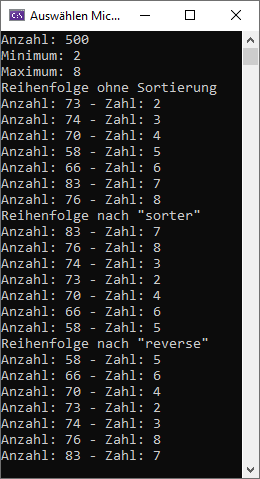

# BEZIEHUNG UND VERERBUNG

Eine variable Anzahl von Integern in einem variablen Zahlenbereich sollen in einer map<int,int> gezählt und danach ausgegeben werden. Nach der Ausgabe sollen die Zahlen anhand der Anzahl von groß nach klein sortiert werden und anschließend nochmal umgekehrt. Beide Sortierungen sollen auch ausgegeben werden. 

## Vorgabe und Hilfe

Eine Map speichert Elemente automatisch anhand der Keys und kann nicht manuell sortiert werden. "std::pair<int, int>" können jedoch in einen Vector geschrieben werden und dann dort sortiert werden. Paare haben zwei Attribute.
- first für den Key
- second für den Wert 

## Ausgabe

