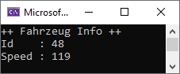
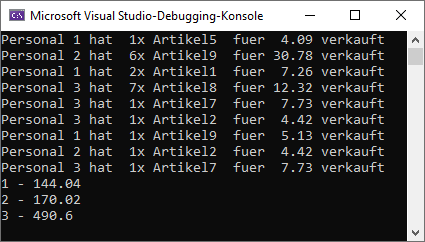

# ADRESSEN UND ZEIGER AUFGABE 1

Es sollen 50 Fahrzeuge erstellt werden und innerhalb eines vectors mithilfe eines shared_ptr abgelegt werden.
Jedes Fahrzeug soll einen zufälligen Speed-Wert zwischen 1 und 120 erhalten

Ziel ist es, dass schnellste Auto zu finden und an die Funktion "FahrzeugInfo" zu übergeben.

## Vorgabe und Hilfe

Die Header- und Quelldatei für Fahrzeug sind vorgegeben, können aber auch selber erstellt werden. 

## Ausgabe

# ADRESSEN UND ZEIGER AUFGABE 2

Die Artikel in einem Lager sollen vom Personal so lange verkauft werden, bis das Lager leer ist. 
Wer den nächsten Verkauf machen darf, wird zufällig entschieden. Sobald das Personal gewählt wurde, wird entschieden, welcher Artikel und in welcher Menge verkauft wird. 
Nachdem der Verkauf abgeschlossen wurde, wird dem Personal der Verkaufspreis zugesprochen, die jeweilige Menge des Artikels entfernt und - sollte der Artikel ausverkauft sein - aus dem Lager gelöscht.

Wenn alle Artikel verkauft sind, sollen die Verkaufszahlen ausgegeben werden. 

## Vorgabe und Hilfe

Über das Lager wird ein neuer "Verkauf" angestoßen, wobei hier das Personal mit angegeben wird. Innerhalb des Lagers wird dann entschieden welcher Artikel verkauft wird.
Der zufällig gewählte Artikel wird dann dem Personal zum "verkaufen" übergeben. Das Personal verkauft nun eine zufällige Anzahl von Artikeln, wobei nicht mehr verkauft werden darf als aktuell im Bestand ist. Nach dem Verkaufen teilt das Personal dem Lager mit, ob ein Artikel ausverkauft wurde oder nicht. Je nachdem wird der jeweilige Artikel dann aus dem Lager entfernt. 

Die Headerdatei für Lager, Artikel und Personal und sind vorgegeben. Quelldateien müssen selber erstellt werden. Je nach Teilnehmer kann die Aufgabe in zwei Teilaufgaben unterteilt werden: 
* Aufbau der Quelldateien
* Umsetzung der Funktionalität

## Ausgabe
