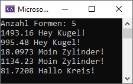

# BEZIEHUNG UND VERERBUNG

Durch eine Eingabe soll bestimmt werden wie viele Formen erstellt werden. Die Formen werden komplett zufällig und mit zufälligen Float-Werten zwischen 1.0 und 10.0 erstellt und als shared_ptr der Basisklasse in einem Vector abgelegt.

Danach soll über den Vector iteriert werden und für jede Form die Fläche ausgegeben und die klassenbezogene Methode aufgerufen werden. 

## Vorgabe und Hilfe

Die Headerdateien für die Formen ist vorgegeben. Quelldateien müssen selber erstellt werden. 
Funktionsformeln können vorgegeben werden (hat nichts mit der Schulung zu tun). 

## Ausgabe

